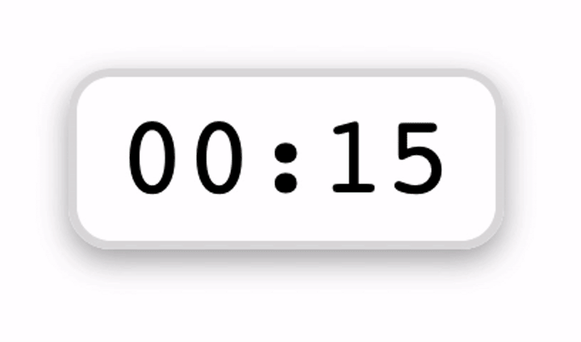

# countdown

<!-- badges: start -->
[](https://CRAN.R-project.org/package=countdown)
[](https://gadenbuie.r-universe.dev)
[](https://github.com/gadenbuie/countdown/actions/workflows/R-CMD-check.yaml)
<!-- badges: end -->

**countdown** makes it easy to drop in a simple countdown timer in slides and HTML documents written in [Quarto](https://quarto.org) or [R Markdown](https://rmarkdown.rstudio.com).

``` r
library(countdown)

countdown(minutes = 0, seconds = 15)
```



### Want to know more?

Check out countdown in its native environment in the [countdown presentation](https://pkg.garrickadenbuie.com/countdown/).

## Installation

### Quarto Extension

``` bash
quarto add gadenbuie/countdown/quarto
```

This will install the extension under the `_extensions` subdirectory. If
you’re using version control, you will want to check in this directory.

To use the extension, use the `` shortcode. For example, a countdown clock can be created by writing anywhere:

``` default

```

Learn more in the [Quarto countdown README](quarto/README.md).

### R Package

You can install countdown from CRAN

``` r
install.packages("countdown")
```

or you can install the development version of countdown from [gadenbuie.r-universe.dev](https://gadenbuie.r-universe.dev/countdown)

``` r
options(repos = c(
  gadenbuie = 'https://gadenbuie.r-universe.dev',
  getOption("repos")
))

install.packages('countdown')
```

or from GitHub

``` r
# install.packages("remotes")
remotes::install_github("gadenbuie/countdown", subdir = "r")
```

Learn more in the [R countdown README](r/README.md).
