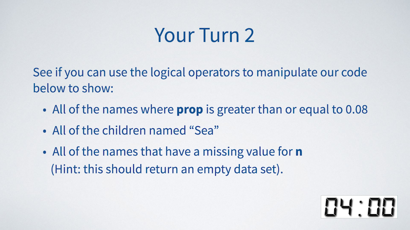
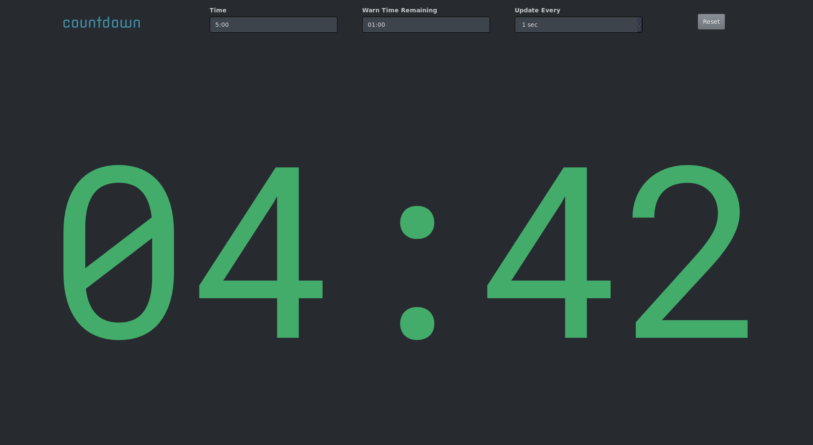

```{r setup, include=FALSE}
options(htmltools.dir.version = FALSE)
```

```{r xaringan-themer, include=FALSE}
library(xaringanthemer)
style_solarized_light(
  header_font_google = google_font("Arvo"),
  header_h1_font_size = "45px",
  text_font_google = google_font("Cabin"),
  text_font_size = "22px",
  code_font_google = google_font("Share Tech Mono"),
  extra_css = list(
    ".remark-slide-content h2" = list(
      "margin-top" = "2em",
      "margin-bottom" = "2em"
    ),
    .big = list("font-size" = "150%"),
    .small = list("font-size" = "75%"),
    .subtle = list(opacity = "0.6"),
    ".countdown-has-style h3, .countdown-has-style h3 ~ p, .countdown-has-style h3 ~ ul" = list(
      "margin" = "0"
    ),
    ".countdown-has-style pre" = list(
      "margin-top" = "-10px"
    ),
    "p .remark-inline-code" = list(
      "background-color" = "#6c71c41a",
      "padding" = "2px 2px",
      "margin" = "0 -2px"
    ),
    blockquote = list("margin-left" = 0),
    "em" = list(color = "#2aa198")
  )
)
```

class: center middle

[xaringan]: https://github.com/yihui/xaringan#readme
[rmarkdown]: https://rmarkdown.rstudio.com
[countdown]: https://github.com/gadenbuie/countdown

# Hey look, it's a timer!

<p style="margin: 11em 0;"></p>

```{r first-timer, echo=FALSE}
library(countdown)
solarized <- xaringanthemer:::solarized
countdown(
  minutes = 0, seconds = 42,
  top = "26%", right = "33%",
  play_sound = TRUE,
  color_border              = solarized$magenta,
  color_text                = solarized$magenta,
  color_running_background  = solarized$cyan,
  color_running_text        = solarized$base02,
  color_finished_background = solarized$red,
  color_finished_text       = solarized$base3
)
```


### How to use your new countdown timer

Click on the timer to **start** it.

Click while running to **bump** it up.

Click when complete to **restart** it.

.small.subtle[&#x1F4F5; Timers don't work on mobile]

---
# Easily add a timer to your slides!

First, install `countdown` from [GitHub][countdown]

```r
remotes::install_github("gadenbuie/countdown")
```

--

Then call on `countdown`

```r
library(countdown)
```

--

and in your [xaringan] slides or [R Markdown][rmarkdown] document add

```markdown
``r 'r'` countdown(minutes = 0, seconds = 42)`
```

or

````markdown
```{r}`r ''`
countdown(minutes = 0, seconds = 42)
```
````

---

# What's so cool about a timer?

.pull-left[
If your slides support your teaching materials, on-screen timers are a great way to bracket group activities.

Put your prompt on the screen and ask the group: 

> _Take 4 minutes to discuss with your partner_

Then click on your timer to keep everyone on track!
]

--

.pull-right[
.center[
I learned this from [&commat;StatGarrett](https://twitter.com/StatGarrett)'s  
rad `rstudio::conf` workshop!



Here's an example from his  
[Master the Tidyverse materials](https://github.com/rstudio-education/master-the-tidyverse/).
]
]

---

class: countdown-has-style

# `countdown` has style

.center[
```r
countdown(...)
```
]

.pull-left[
### Each Timer

Settings of individual timers

- _`minutes`_
- _`seconds`_
- `play_sound`
- `top`
- `right`
- `bottom`
- `left`
- `update_every`
- `warn_when`
- .subtle[`font_size`]
- .subtle[`margin`]
- .subtle[`padding`]

.footnote[Faded arguments inherit from first timer &#x27A1;]
]

.pull-right[
### The first-time timer

Sets defaults for all other timers

- `font_size`
- `margin`
- `padding`
- `box_shadow`
- `border_width`
- `border_radius`
- `line_height`
- `color` options for 
  - `_background`, `_border`, `_text`
  - and for `running`, `finished`, `warning`
]

---
layout: true

# The first-time timer

---

Here's how I created the first timer and set this presentation's timer styles.

``` r
library(countdown)

# Get the solarized color palette
solarized <- xaringanthemer:::solarized

countdown(
  minutes = 0, 
  seconds = 42,
  # Fanfare when it's over
  play_sound = TRUE,
  # Set timer theme to match solarized colors
  color_border              = solarized$magenta,
  color_text                = solarized$magenta,
  color_running_background  = solarized$cyan,
  color_running_text        = solarized$base02,
  color_finished_background = solarized$red,
  color_finished_text       = solarized$base3
)
```

---

If you customize your timer's styles, **you only have to do it the first time**.  
The theme of your first timer sets the theme for all timers.  

--

After that, you only ever _need_ to specify `minutes` and `seconds`<sup>&#x2731;</sup>.

.footnote[
<sup>&#x2731;</sup> Feeling lazy? Just set `minutes`. No need for pesky `seconds`.
]

--

The default timer looks pretty good, so try it first!

```r
countdown(minutes = 0, seconds = 15)
```

.center[
<iframe src="default-timer/index.html" width="210px" height="125px" style="border:3px solid #002b36;"></iframe>
]

---
layout: false

# Moar timers!


You can have as many timers as you want, even on the same screen.  
--

Use the `top`, `bottom`, `left` and `right` arguments to position the timers.

--

<p style="margin-bottom: -10px">The default is <strong>bottom</strong>, <strong>right</strong>.</p>
```{r}
countdown(minutes = 0, seconds = 7, bottom = 0)
```

<p style="margin-bottom: -10px">This timer is <strong>top</strong>, <strong>right</strong>.</p>
```{r}
countdown(minutes = 0, seconds = 13, top = 0)
```

<p style="margin-bottom: -10px">This timer is <strong>bottom</strong>, <strong>left</strong>.</p>
```{r}
countdown::countdown(minutes = 0, seconds = 21, left = 0)
```

.center.big[
&#x1F446;&#x1F3FC;  
&#x1F448;&#x1F3FC; Go ahead, click them! &#x1F449;&#x1F3FC;
]

---

# Customize your timers

`top`/`bottom` and `left`/`right` cancel each other out unless you specify both.

You can also override the global timer `font_size`, `padding`, and `margin`.

```{r}
countdown(minutes = 1, seconds = 30, 
          left = 0, right = 0,
          padding = "15px",
          margin = "5%",
          font_size = "6em")
```

---

# Full-screen timers

Set `top`, `bottom`, `left` and `right` all to `0` to get a full screen timer, or
use  `countdown_fullscreen()` for a (possibly stand-alone) [full-screen timer](fullscreen/index.html).

--

Very helpful for hiding content while the activity is going on, or for presenters.

--

Here's the code<sup class="small">&#x2731;</sup>:

```{r full-screen, eval=FALSE}
countdown_fullscreen(minutes = 0, seconds = 90,
                     padding = "20%", margin = "5%",
                     font_size = "8em", line_height = "1.25")
```


.footnote[<sup class="small">&#x2731;</sup>_some fiddling with `padding`, `margin` and `font_size` is required in **xaringan** slides, for stand-alone timers, use the default values_]

--

```{r echo=FALSE}
<<full-screen>>
```

---
class: center top

<div style = "padding-top: 3em"></div>

# Keep Calm

### and

# Countdown

Avoid countdown panic with a timer<br>that only **update**s once **every** *n* seconds

```{r}
countdown(minutes = 1, update_every = 15, right = "33%")
```

---

# Be Warned Before Time Runs Out

Warn your audience that time is about to run out. The warning style is applied to the timer for the last _N_ seconds by setting `warn_when = N`.

```{r}
countdown(0, 10, warn_when = 5, right = "33%", bottom = "33%")
```

<p style="padding-top: 10em"><p>

Modify the `background`, `text` and `border` colors of the warning state using the `color_warning_...` arguments.

---

# Behind the scenes

Behind the scenes, `countdown` is a little R wrapper around  
a very small amount of HTML and CSS and bit more of Javascript.

Each countdown timer element looks something like this:

````html
```{r echo=FALSE, results="asis"}
x <- countdown(3, 30)
x <- gsub("((code|span)>)(<span)", "\\1\n    \\3", x)
x <- sub("(span>)(</code)", "\\1\n  \\2", x)
cat(paste(x), sep = "\n")
```
````

--

Once the timer is activated, `<div class="countdown">` gets an added class:

- `running` when the timer is _running_, or
- `finished` when the timer is _finished_.

---

# Customized CSS

Want to completely customize the CSS of each timer?  
--

No problem! 

--

Just give each timer a unique `id` that you can use in your CSS.

```{css}
#special_timer.running {
  background-color: black;
  background-image: url(img/bg-stars.gif);
}
#special_timer.finished {
  background-color: black;
  background-image: url(img/bg-sqfw.gif);
  background-size: cover;
}
#special_timer.running .digits {
  color: #fdf6e3;
}
```

```{r}
countdown::countdown(0, 9, id = "special_timer")
```

<div style="position: absolute; bottom: 2%; right: 27%; font-size: 80%">Try this one, it's cool!<span style="display: inline-block; transform: rotate(236deg);font-size: 125%;">⤹</span></div>

---

# Make a joyful noise!

`countdown` timers are quiet by default, but it can be nice to have a noisy timer that gets everyone's attention.

Set `play_sound = TRUE` to be alerted to the end of the timer with fanfare!

```{r}
countdown(0, 10, play_sound = TRUE)
```

Check out [beepr](https://github.com/rasmusab/beepr) if you want awesome sound alerts in your R session!

---

# A Shiny countdown app

**countdown** ships with a [Shiny app](https://shiny.rstudio.com) for an interactive _full-screen countdown timer_!

To launch the app, run

```r
countdown_app()
```

or use the version hosted online at [apps.garrickadenbuie.com/countdown](https://apps.garrickadenbuie.com/countdown/).

.center[
<a href="https://apps.garrickadenbuie.com/countdown/">

</a>
]

---

background-image: url(https://media.giphy.com/media/xT5LMRClPgWMjpEmbe/giphy.gif)
background-size: cover

